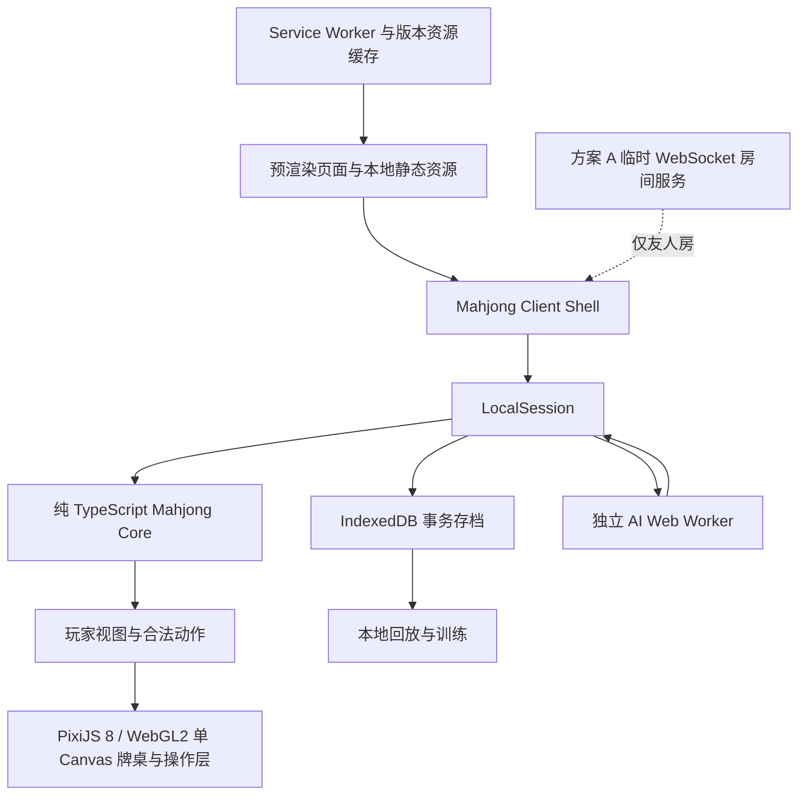
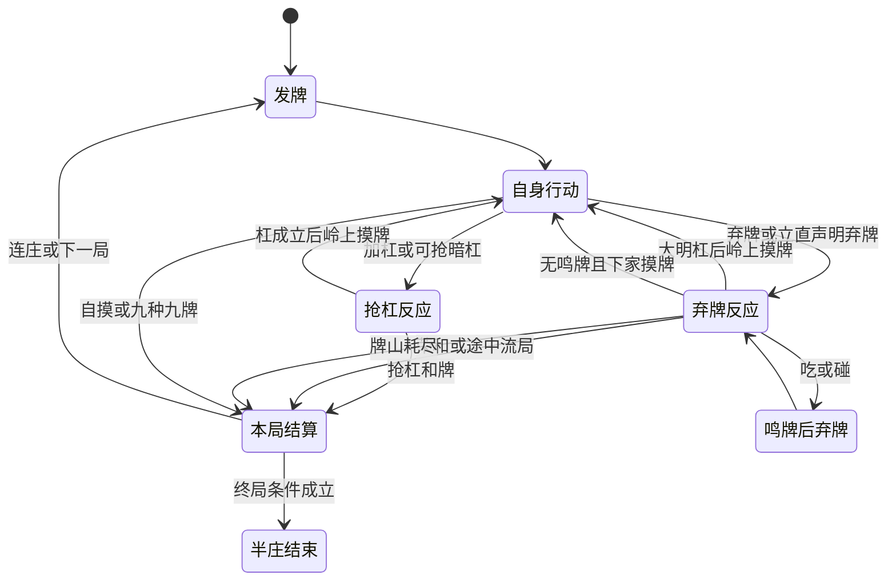

# Vibe 日本麻将 App 开发方案

> 版本：1.2（方案 A：纯前端核心 + 临时友人房服务） · 编制日期：2026-09-16 · 建议入口：`/lab/mahjong`
>
> 定位：基于 Vibe 现有工程的实施方案，规则、AI、渲染、训练与牌谱完全在浏览器运行；仅为跨设备友人房提供无账号、无持久化的临时 WebSocket 转发，优先规则正确、本地可恢复、手机可用与离线能力。
>
> 本文只设计开发方案。目录、接口、指标和里程碑中标为“建议／计划”的内容尚未实现，不代表已完成验证。

阅读顺序：先看第 1–4 节确认范围与工程接入，第 5–12 节用于实现和评审，第 14–17 节用于验收、排期与拆分任务。第 18 节列出启动假设和核验边界。

## 1. 推荐结论与交付边界

采用 **Next.js + React + 独立 TypeScript 日麻核心 + PixiJS 8 / WebGL2 单 Canvas**，在 Vibe 内新增一个前端 Lab App。洗牌、规则裁决、AI、计分、存档、回放与训练统计均在用户浏览器执行；跨设备友人房只把房间加入、准备、开局和离开消息交给临时转发服务，服务不裁决规则、不保存牌局。牌桌、手牌、牌河、按钮、结算和训练提示全部绘制在同一张 Canvas 中，DOM 只负责承载 Canvas 节点，不提供第二套交互界面。

**麻将核心不依赖后端、API、云数据库、云函数、远程 AI 或远程遥测。** 方案 A 唯一的网络例外是一个可选的临时 WebSocket 房间服务：只保存内存中的四位房间、连接和最近活动时间，默认两小时过期，不保存账号、牌谱、手牌或个人数据。服务只转发房主裁决的房间快照和成员请求，单人模式与离线训练完全不连接它。

### 1.1 “纯前端”的可执行边界

- **运行时**：单人模式开始对局后无需任何麻将业务网络请求；准备好离线资源后，断开网络仍可开始新局、完成半庄、续局、回放和导出。友人房只有在用户主动创建或加入时连接临时房间服务。
- **页面与资源分发**：沿用 Vibe 已有 HTTPS 页面及静态文件分发，不新增服务器资源。首次获取 HTML / JS / 字体 / 牌面或主动下载新版资源仍会使用已有站点带宽；“零业务后端”不能写成“首次访问无需任何资源来源”。
- **工程框架**：保留 Next.js 构建与既有路由，不把麻将状态送进 Server Component、Server Action 或 Route Handler。麻将页面应在构建时预渲染，并以生产构建产物确认；共享框架已有 Server Component 不等于麻将规则需要后端。
- **离线交付**：PWA 缓存是正式路径。浏览器 Service Worker 需要安全上下文，不能承诺双击 `file://` 文件就拥有完整 PWA / Worker 能力；离线资源未准备时明确提示。[MDN Service Worker](https://developer.mozilla.org/en-US/docs/Web/API/Service_Worker_API)
- **范围**：Vibe 其他 App 的现有 API 不属于此次改造范围；麻将功能不调用它们，也不为此把整个 Vibe 改为静态导出或迁站。
- **高可用定义**：本机故障可恢复、存档失败可感知、渲染 / AI 可降级、准备后离线可玩；友人房具备连接失败、房间满、过期、断线和房主离开提示。浏览器数据被清除、设备丢失或房主永久离线不具备云端恢复保障。

### 1.2 两个正式版本与一个可选实验

| 版本                  | 用户可获得的能力                                                                     | 发布前必须满足                                                      |
| --------------------- | ------------------------------------------------------------------------------------ | ------------------------------------------------------------------- |
| V0.1：离线单人版      | 人类 + 3 个基础 AI，四人半庄、完整计分、手机布局、本地续局、牌谱导入导出、离线新开局 | 固定预设完整；规则与回放通过；存档和 GPU 失败有出口；离线全过程验收 |
| V0.2：本地训练版      | 牌效与攻守解释、按局复盘、本地统计；条件成熟时加入已有模型的浏览器推理               | 建议只读玩家可见信息；模型可选且本地推理；无模型仍完整可玩          |
| E1：方案 A 友人房实验 | 四台设备输入同一四位码，经临时 WebSocket 服务加入，由房主浏览器裁决                  | 服务仅内存转发；房间上限 4、TTL 2 小时；房主失联时所有端明确结束    |

V0.1 的 AI 定义为“遵守规则、具备基础牌效和攻守能力”。高水平日麻训练 AI 保留为后续目标，不因使用向听或 ONNX 就宣传达到强 AI 水平。

不承诺“任意网络稳定联机”或“房主关页后其他人自动继续”。四位码跨设备加入属于方案 A 的明确范围，但依赖部署方提供可达的 `wss://` 服务地址；服务中断时单人训练仍可继续，友人房应显示可解释的失败原因。

### 1.3 对调研建议的最终取舍

| 调研建议                                       | 纯前端方案处理                                 | 原因                                                         |
| ---------------------------------------------- | ---------------------------------------------- | ------------------------------------------------------------ |
| 独立 Mahjong Core                              | 保留                                           | 可在浏览器及本地测试中独立完成半庄                           |
| 136 张实体、合法动作、视图隔离                 | 保留                                           | 保证规则、计分与 AI 信息边界                                 |
| seed + actions 回放                            | 保留并版本化                                   | 支持续局、复盘和故障复现                                     |
| Vite、Zustand、Vitest                          | 不引入                                         | 复用现有 Next.js、React 与 Node Test Runner                  |
| PixiJS 8 / WebGL2                              | 首个可玩切片即采用单 Canvas                    | 视觉和交互保持同一坐标系；GPU 失败时在同一 Canvas 绘制诊断页 |
| 1920 × 1080 统一缩放                           | 改为容器自适应重排                             | 手机手牌触点不能被无限缩小                                   |
| Cloudflare Worker / Durable Objects / 云数据库 | 不引入                                         | 房间服务保持单进程内存模型，不引入云数据库或厂商 SDK         |
| 临时 WebSocket 房间服务                        | 方案 A 仅用于友人房                            | 只转发消息，TTL 清理，不参与规则裁决                         |
| WebRTC、STUN / TURN、公共实时 SDK              | 不引入                                         | 方案 A 不需要点对点协商和第三方实时依赖                      |
| 四位房号                                       | 保留并由服务定位房间                           | 四位码只作为临时房间索引，不承载身份、牌谱或连接凭据         |
| IndexedDB、Worker、本地 AI                     | 保留并提升优先级                               | 是纯前端续局、性能和可用性的基础                             |
| ONNX / 自训练                                  | 仅考虑已有许可模型的本地推理；训练不纳入本项目 | 不引入推理 API 或 GPU 服务器                                 |

用户的纯前端约束优先于调研文件及上一版方案；本文所有目录、测试、排期与验收均按这一约束修订。

## 2. 已核对的 Vibe 工程事实

检查基线为工作区 `D:\vibe`、提交 `e9a3a9f` 及当时未提交的工作区内容。以下版本来自本地安装包与锁文件核对，不是只看 `package.json` 的版本范围。

| 项目             | 实际情况                                                        | 对开发方案的影响                                                |
| ---------------- | --------------------------------------------------------------- | --------------------------------------------------------------- |
| 框架             | Next.js 16.2.10、React 19.2.7                                   | 使用现有 App Router，不建立 Vite 子站                           |
| 类型与样式       | TypeScript 5.9.3 strict、Tailwind CSS 4.3.2、CSS Modules        | 复用现有类型、主题、断点及样式边界                              |
| 本机工具         | Node.js 24.15.0、pnpm 11.25.0                                   | CI 需另行固定并验证 Node / pnpm 版本；本机版本不是生产配置证明  |
| 构建             | `next dev --turbopack --port 3000`、`next build`                | Worker、Pixi 和资源路径均需在生产构建验证                       |
| Lab 入口         | `src/app/lab/[slug]/page.tsx`                                   | 已有静态参数、metadata、404 和显式 loader                       |
| 页面容器         | `max-w-5xl`，带面包屑和内边距                                   | 先按实际内容宽度布局，不假设可占满 1920px                       |
| App 注册         | `src/features/lab/registry.ts` + `src/features/apps/loaders.ts` | 新增 `mahjong` 时两个入口同步更新                               |
| 测试             | `pnpm run test` → `node --test`                                 | 核心回归继续使用 `node:test`，无需换测试框架                    |
| 本地游戏         | Sudoku、Minesweeper 的引擎 / Canvas；RPG 的存档校验             | 可参考领域拆分、Canvas 生命周期与坏档处理，不能当成现成日麻能力 |
| PWA              | `public/sw.js` + `ServiceWorkerRegistration.tsx`                | 已有离线外壳，但没有完整麻将资源缓存与存档版本协议              |
| 既有其他 App API | `/api/rss`、`/api/agent/**` 等 Route Handlers                   | 麻将不调用；不为本功能改动其他 App 或全站静态导出               |
| workspace        | `pnpm-workspace.yaml` 目前只有 overrides                        | 文件存在不代表已有 `apps/*` / `packages/*` 多包布局             |
| 尚未具备         | 无 PixiJS、ONNX、Playwright 等游戏相关依赖                      | 仅在对应前端阶段按需引入，不安装后端工具                        |

初版核验及本次修订时，`loaders.ts`、`registry.ts` 均有未提交修改，且存在新增 `note/` 功能。实施时应在当前内容上追加麻将注册，不覆盖这些工作。

### 2.1 直接沿用的工程约束

- 业务代码放 `src/features/apps/mahjong/`；路由只负责组合，浏览器能力放 Client Component 叶子。
- `.tsx` 不使用 `style={{}}`；复杂牌桌使用 CSS Module，间距和圆角使用已有 token。
- `md` 仍为 768px；移动优先；交互目标建议至少 40 × 40px；保留缩放。
- 主题色从 CSS 变量读取；非交互结构用黑灰，紫色用于交互；麻将牌面符号的语义色作为资源颜色单独审查，不扩大为装饰背景。
- 不使用 transform 交互动效、`transition: all`、无意义背景、远程字体。
- 新增函数、组件及 Hook 按仓库要求写紧邻定义的简短中文注释。
- 新依赖同步锁文件；每次代码交付都必须通过 test、lint、typecheck、build，并审计测试清理。

`AGENTS.md` 的包管理一节同时写有“使用 pnpm”与“不要使用 pnpm”，存在文字冲突。依据该节命令示例、README、锁文件及全篇验收要求，本方案统一采用 `pnpm`；不在本次文档任务中修改工程指南。间距同样优先遵循 4px 倍数要求，新增页面不使用已有 6/9/10px token。

## 3. 范围与可用性目标

### 3.1 正式交付的用户流程

```text
Lab → 日麻（仅暴露一张 Canvas）→ 选择「单人模式」或「友人牌局」
    → 单人模式 → AI 四人半庄 → 查看规则 → 摸打 / 鸣牌 / 立直 / 和牌
    → 本局得分明细 → 下一局 → 半庄顺位
    → 本地保存牌谱 → 按动作回放 / 导出 JSON

     → 友人牌局 → 创建 / 输入四位房间码 → 临时 WebSocket 服务同步 → 四席准备 → 房主开始友人对局

设置 → 准备离线资源 → 完整性检查通过 → 断网重新打开
    → 新建 / 继续 / 回放 / 导出（均无需业务网络）
```

训练版在同一个本地数据基础上增加局面练习、切牌建议和统计。跨设备迁移依靠用户导出 / 导入文件，不做云同步、公共牌谱链接或账号恢复。

正式版包含受限的四设备友人房实验：四台设备输入房主分享的四位码，通过方案 A 临时服务同步席位、准备和开局；牌局裁决仍由房主浏览器负责。三麻、段位、匹配、商城、账号、聊天、观战和付费能力仍不包含。

### 3.2 建议验收指标

下表是工程目标，尚无测量结果。P0 固定测试设备、浏览器版本、测量脚本与资源基线。

| 指标       | 建议门槛                                                 | 测量方法                                                 |
| ---------- | -------------------------------------------------------- | -------------------------------------------------------- |
| 规则正确性 | 固定预设规则矩阵 100% 通过，无已知错判 / 错分            | 表驱动用例 + 人工复核 + 差分测试                         |
| 核心健壮性 | 发布前累计 10,000 个固定种子半庄无不变量失败             | 无 UI 模拟；失败种子永久保留                             |
| 本地续局   | 恢复到最后成功事务；建议恢复到可操作状态 p95 ≤ 2 秒      | 出牌、鸣牌和结算中途刷新 / 强制终止                      |
| 后端依赖   | 单人 / 离线业务 API 为 0；友人房仅连接配置的临时 WSS     | 分模式审计请求；服务只转发房间控制消息，不接收牌谱或手牌 |
| 离线独立性 | 准备完成后，断网冷启动并完成一个新半庄、续局、回放、导出 | 关闭页面后以浏览器离线状态重新打开；不只测试旧页面内存   |
| 输入反馈   | 点击到本地选中反馈 p95 ≤ 100ms                           | 基准手机实测                                             |
| 本地持久化 | 正常环境单次动作事务完成 p95 ≤ 100ms，失败不虚报已保存   | IndexedDB transaction complete / abort 计时              |
| AI 决策    | 基准手机 p95 ≤ 300ms；单次预算 1 秒                      | 500 个复杂局面，后台挂起单列                             |
| 牌桌表现   | 基准手机活跃绘制 ≥ 30fps；静止时按需绘制                 | 连续 30 分钟及横竖屏 / 前后台切换                        |
| 资源预算   | 入口增量 JS gzip ≤ 150KB；基础首次可玩增量 ≤ 2MB         | 相对 Vibe 基线；Pixi、牌面资源与可选模型分别报告         |
| 故障恢复   | Worker、GPU、存储失败均有已测试的继续 / 导出路径         | 可重复故障注入与真机验收                                 |

本地事务提交只能承诺正常浏览器生命周期下的恢复边界，不保证系统级掉电、磁盘损坏或浏览器清理后数据不丢；永久保留需要用户导出备份。这里不使用云服务月度 SLA、全球在线率或并发房间容量作为纯前端指标。

E1 的握手成功率、重连时长和 Host 可用性独立记录，不借单人模式的成功率为其背书；详见第 12 节。

## 4. 架构与代码落点

### 4.1 浏览器内完成闭环



除方案 A 房间服务外，所有节点都在构建产物或用户浏览器内。Web Worker 负责本地后台计算，Service Worker 负责本地缓存；房间服务只维护内存连接，不承载麻将规则。

Core 不导入 React、DOM、Pixi、IndexedDB 或网络；接收命令和显式上下文，返回候选状态及事件。时间、随机初始化、存储和调度由 LocalSession 管理。AI 只接收对应玩家视图，不能拿到完整牌山。

React 不再镜像保存另一份可随意修改的完整牌局；Session 维护权威状态，对 Canvas 发布不可变 PlayerView。选牌、弹层和音量由 Canvas 场景状态控制；必要时使用 `useSyncExternalStore` 订阅 Session，不预先引入状态库。

### 4.2 目录和接入点

```text
docs/
  riichi-mahjong-development-plan.md
src/features/apps/mahjong/
  page-client.tsx                # 单人、续局、离线、规则、牌谱入口
  components/
    PixiMahjongSurface.tsx       # 唯一可视节点与 Canvas 事件入口
  styles/
    Mahjong.module.css
  core/
    types.ts
    tiles.ts
    rules.ts
    random.ts
    engine.ts
    actions.ts
    reactions.ts
    hand.ts
    scoring.ts
    settlement.ts
    player-view.ts
    *.test.ts
  session/
    local-session.ts
    use-mahjong-session.ts
  ai/
    heuristic.ts
    evaluation.ts
    protocol.ts
  workers/
    ai.worker.ts
  persistence/
    database.ts
    replay.ts
    validation.ts
  offline/
    assets.ts                   # 构建期资源清单对应的前端读取与校验
    prepare.ts                  # 用户触发下载、校验和就绪标记
  renderer/                     # Canvas 场景绘制辅助，仍输出到唯一 Canvas
    scene.ts
    layout.ts
    assets.ts
public/assets/mahjong/tiles/    # 本地打包的公有领域牌面 PNG
  assets-manifest.json           # 计划在构建后生成，带版本和资源摘要
server/
  mahjong-room.mjs               # 方案 A：无账号、无持久化的临时 WebSocket 房间转发
```

不创建麻将 API、云数据库或 Monorepo 共享包；Core、AI、测试在现有 feature 内通过相对路径复用即可。方案 A 服务保持独立的 `server/mahjong-room.mjs`，不进入浏览器 bundle，不保存业务数据。

注册采用 `slug: 'mahjong'`、`category: 'game'`、`href: '/lab/mahjong'`、`dataSource: 'local'`，loader 为字面量 `() => import('./mahjong/page-client')`。不覆盖已有 note 注册。

### 4.3 在 Next.js 中落实纯前端

- 保留现有动态 slug 页的 `generateStaticParams()`、metadata 和路由胶水，不在路由渲染中创建牌局、访问 IndexedDB 或加载模型。
- 用生产构建路由输出核实麻将页可预渲染。若当前 route / shell 有请求期依赖，先定位再隔离麻将叶子页面；不可仅凭写了 `'use client'` 就宣称没有 SSR 或业务后端。
- Core 初始化、Worker 创建与存储读取仅发生在客户端生命周期或用户操作中，避免水合时重复建局。
- 浏览器 Worker 使用可静态分析的字面量 URL，在当前 Turbopack 与生产 build 中验证；Worker 类型只在相关文件限定，不向全局混入另一套运行时类型。
- 图片、字体、音效、WASM 和可选模型从同源静态资源加载；不运行时从 CDN 导入模块，也不请求任何 AI API。
- 麻将入口 / Lab 卡片预取可能产生 Next.js 页面或静态 RSC 资源请求；它们属于框架资源分发，不是游戏 API。离线页不能依赖请求期 RSC 才能打开，需纳入离线冷启动验收。
- 不设置全站 `output: 'export'`，避免破坏已有其他 App。麻将的规则与用户数据仍严格留在浏览器，不新增每步服务端计算。

本地开发用 `pnpm run dev`，生产浏览器验收可用 `pnpm run build`、`pnpm run start` 提供测试页面；本机开发工具不是需要为用户运行游戏而部署的业务服务。

### 4.4 日麻单 Canvas 交互契约

- `/lab/mahjong` 的可视页面只渲染一个 `<canvas>`；不再同时渲染 HTML 手牌、按钮、牌河或结算面板。
- PixiJS `Application` 使用 WebGL 渲染，牌面素材从 `public/assets/mahjong/tiles/` 通过 `Assets.load` 同源读取；运行时不请求外部素材服务器。
- 指针、触摸和键盘输入统一由 Canvas 坐标命中区域转成 Core 的 `LegalAction`。Canvas 绘制失败时仍在同一 Canvas 显示可诊断的 2D 画面，不切换到第二套 DOM UI。
- 牌面 PNG 采用 FluffyStuff `riichi-mahjong-tiles` 公有领域素材，许可原文随资源保存在 `LICENSE.md`；替换素材时必须保留来源、许可和本地清单。
- Canvas 首屏必须通过固定 seed 保证服务端预渲染与客户端水合一致；随机种子只在用户点击重新开局后生成。

## 5. 日麻规则契约

### 5.1 先冻结一个完整预设

首版建议预设名 **`vibe-riichi-v1`**，界面显示“Vibe 四人半庄规则”。它是明确公开的应用规则，不宣传为雀魂、天凤、WRC 或 EMA 的完整复刻。配置版本写入每个存档、房间与牌谱；开局后不可修改。

EMA 的官方入口确有 2025 规则及注释资料，可作为术语和规则评审入口。本次官方 PDF 获取超时，未逐条核对全文；P0 必须取得并固定可访问版本、条款编号与差异表，不能把本文拟定规则误称为已通过赛事规则认证。[EMA 规则入口](https://mahjong-europe.org/portal/index.php?Itemid=101&id=12&option=com_content&view=category)

| 规则项         | 建议首版默认                                                                       |
| -------------- | ---------------------------------------------------------------------------------- |
| 人数、牌与局制 | 四人，136 张，东南半庄；不含花牌                                                   |
| 起点与终点     | 25,000 点起；仅按实际点数与顺位结算，不加返还点、oka、uma                          |
| 赤牌           | 万、筒、索各一张赤五；各自替换普通五，不增加实体总数                               |
| 食断与后付     | 允许食断与后付；和牌时必须有役                                                     |
| 宝牌           | 表、里、杠、杠里及赤宝牌；里宝牌仅已成立立直者可计；宝牌本身不是役                 |
| 立直           | 门清、听牌、至少 1,000 点且活牌山至少 4 张；含双立直和一发                         |
| 切上满贯       | 不启用                                                                             |
| 数满与役满     | 累计 13 番及以上按单倍累计役满；天然役满可叠加，不叠加普通役 / 宝牌                |
| 双倍役满       | 首版关闭；特殊形按对应单倍役满                                                     |
| 多家荣和       | 允许双响；三家荣和按三家和流局；不采用头跳                                         |
| 多家支付       | 放铳者向每家独立支付基本点及本场；供托只给从放铳者下家起最近的和牌者               |
| 包牌           | 首版启用大三元 / 大四喜包牌；单独记录触发副露；责任支付须有分项测试                |
| 正常流局       | 听牌者与未听者之间结算 3,000 点；四家全听 / 全不听不交换                           |
| 途中流局       | 九种九牌、四风连打、四家立直、四杠散了、三家和，分别实现判定时点                   |
| 流局满贯       | 首版关闭；界面明确展示，避免“默认标准规则”含混处理                                 |
| 连庄与本场     | 庄家和牌 / 正常流局听牌连庄；途中流局连庄；任何流局本场 +1；闲家和牌换庄并清零本场 |
| 终局           | 点数小于 0 时飞人结束，0 点继续；南四庄家和牌且单独第一时自动和了止                |
| 南四流局       | 不启用听牌止；庄家听牌继续，庄家不听换庄后结束                                     |
| 西入           | 不启用；南四轮庄即结束，没有 30,000 点延长条件                                     |
| 同分           | 以开局座次东南西北优先排序；终局剩余供托归按此规则排第一者                         |
| 超时           | 反应窗口视为 PASS；自身行动优先摸切，无摸入牌时按固定实体顺序选合法弃牌            |

包牌支付默认：只分配对应的役满成分；自摸由责任者承担该成分全部，第三者放铳时由责任者与放铳者平分，责任者本人放铳则全付。本场仍按普通和牌方式支付，供托按上表独立处理。此项作为 Vibe 明示约定，不借“标准”二字隐藏流派差异。

首版不开放自由组合数十个开关。内部保留有类型的配置与完整 preset；未来增加东风或其他规则须以新预设、新用例发布。未实现规则不得作为可选择选项出现。

### 5.2 役种和计分模块的完成标准

建立逐项矩阵，每项至少包含成立、不成立、门清 / 副露差异和互斥关系。范围包括：

- 立直、双立直、一发、门清自摸、断幺九、平和、一杯口、役牌。
- 三色同顺、一气通贯、混全带幺九、纯全带幺九、对对和、三暗刻、三杠子、三色同刻、小三元、混老头、七对子、二杯口、混一色、清一色。
- 岭上开花、抢杠、海底摸月、河底捞鱼。
- 国士无双、四暗刻、大三元、小四喜、大四喜、字一色、绿一色、清老头、九莲宝灯、四杠子、天和、地和。
- 不收录人和、大车轮等地方役；不做八连庄等额外奖励。

和形需要覆盖一般四面子一雀头、七对子、国士；七对子不能把同种四张当成两对。多种拆解和不同和牌张归属要逐一评分，选合法且对和牌者收益最高的解释，并稳定处理同分选择。

评分结果输出役列表、番、符明细、上限、各家支付、本场和供托，不能只返回“总得分”。支付使用整数点和向上取整到百点，独立测试平和自摸 20 符、七对子 25 符、门清荣和加符、连风牌雀头、明暗刻 / 杠、边嵌单骑及上限。

建议使用 [MahjongRepository/mahjong](https://github.com/MahjongRepository/mahjong) 作为开发期手牌计分与向听的差分参照。该项目提供相关计算，不能替代整个对局状态机；固定版本、许可和规则选项后生成静态用例，生产浏览器不依赖 Python，也不把“库返回相同”当成所有流派规则都正确。

### 5.3 必须单独说明的特殊时序

1. **立直是待确认声明**：声明弃牌先进入反应窗口，被荣和则不成立、不扣棒；无人荣和后才扣 1,000 点、锁定手牌。声明牌被吃碰时立直可成立，但一发已中断。
2. **振听分三种**：舍牌振听、同巡振听、立直后见逃振听；依据整个和牌等待集合检查，不能只检查当前来牌。同巡振听在下一次自己摸牌解除，立直见逃持续本局；振听只禁止荣和。
3. **鸣牌优先级**：荣和高于碰 / 大明杠，高于吃；吃只允许上家弃牌。先收集反应，再统一决议，不按网络到达顺序给人优势。
4. **杠先待决议再提交**：加杠先开放抢杠窗口，成立前不能抽岭上或提前翻新指示牌；暗杠仅允许国士抢杠，作为本预设的明确规则。
5. **立直后暗杠**：只允许摸入第四张后的合法暗杠；必须验证等待及合法拆解未改变，不以“向听仍为 0”替代合法性。
6. **杠与牌山**：活牌山无补充空间、四张岭上已用尽时禁止新杠；暗杠 / 加杠 / 大明杠的成功声明均中断相关一发与首巡状态。
7. **四杠散了**：不同玩家完成第四杠后，允许岭上和牌及随后弃牌的荣和，未和则流局；同一玩家四杠可继续。第五次杠永远不可用。
8. **杠宝牌时点**：本预设在成功杠提交后、岭上摸牌前翻开，所有杠一致；抢杠和牌不增加此次杠的宝牌。
9. **食替**：禁止吃碰后切同一牌种；吃还禁止形成另一侧顺子的换吃弃牌。由动作枚举给出合法弃牌集合，不能交给 UI 猜。
10. **最后一张**：明确活牌山最后摸牌的海底、其弃牌的河底和岭上摸牌区别；无后续活牌可摸时不开放吃碰杠。
11. **首巡流局**：九种九牌要求自己的首次摸牌后且此前无鸣牌；四风连打要求无人鸣牌且四家第一弃牌为同一风牌。第四家立直须先完成声明弃牌的荣和判定，无荣和且立直成立才触发四家立直流局。

这些约定必须进入 `rules.ts`、规则面板和永久回归用例，不能只留在开发备注里。

## 6. 核心数据与状态机

### 6.1 牌的身份和所有权

牌种是 34 种；实体是 0–135 共 136 张。实体 ID 与牌种 / 赤牌通过不可变牌表映射；展示文字 `5m`、`0m` 不是实体身份。赤牌替换哪张实体由牌表版本固定。

定义唯一的实体归属：活牌山、王牌、某玩家暗手牌、某玩家副露、尚未被鸣走的弃牌。宝牌指示牌是王牌的引用，不另算一张。牌河记录保持历史，但被鸣走的弃牌只是对副露实体的引用，不能同时算作“牌河拥有”和“副露拥有”。荣和牌同样作为和牌输入引用，不复制给多个赢家。

王牌用固定槽位和索引表示：14 张由岭上、表 / 里指示牌槽位组成；每次杠取走岭上后，将活牌山末端一张移入王牌补位，保持王牌所有权总数。剩余可摸数量必须随这一动作正确减少。

每次成功迁移后检查：

```text
所有实体 ID 的唯一归属数 = 136
每个牌种实体数 = 4；赤牌数量与规则一致
玩家点数之和 + 供托数 × 1000 = 100000（结算前后均成立）
副露与暗手牌数量满足当前阶段的结构约束
seq 单调递增；非法动作不改变牌局与 RNG 状态
```

本场只是计分参数，不是预先存放在桌上的点数。终局分配剩余供托后供托清零，仍保持点数守恒。

### 6.2 关键类型契约（设计示意）

```ts
type Seat = 0 | 1 | 2 | 3;
type TileId = number; // 在输入边界验证为 0–135 的整数

type Phase =
  | { kind: 'self-action'; seat: Seat; drawnTileId: TileId }
  | { kind: 'post-call-discard'; seat: Seat }
  | { kind: 'discard-reaction'; windowId: string; sourceSeat: Seat }
  | { kind: 'kan-reaction'; windowId: string; sourceSeat: Seat }
  | { kind: 'round-result' }
  | { kind: 'match-result' };

interface ActionRequest {
  protocolVersion: number;
  matchId: string;
  roundId: string;
  commandId: string;
  decisionId: string;
  observedSeq: number;
  actionId: string;
}
```

上述类型只展示边界，不是可直接复制上线的完整模型。完整 `MatchState` 还需含固定初始座次、庄家、场局、本场、供托、各玩家点数和振听标记、王牌槽位、活动反应窗口、规则 / 引擎版本、PRNG 状态及已接受决策。

`actionId` 指向当前合法动作中的具体选项，例如同一次吃的不同组合、普通五与赤五的选择。本地 Session（E1 为 HostSession）仍重新校验动作与所属玩家，不能把拿到 actionId 当授权。

接口职责固定为 `createMatch`、`getLegalActions`、`applyCommand`、`createPlayerView`、`evaluateHand`。Core 返回 `accepted` 或有类型的拒绝原因，如 `STALE_DECISION`、`WRONG_PHASE`、`ILLEGAL_ACTION`；不抛字符串让 UI 解析。

### 6.3 行动与反应



大明杠来自弃牌反应；暗杠无需抢杠时可直接提交。图中不把“鸣牌后弃牌”误做一次摸牌。发牌可固定庄家先 13 张再执行第一摸，保持与普通自身行动一致，并正确记录天和 / 地和所需首巡上下文。

反应窗口保存 `windowId`、候选座位、每家应答及截止时间。所有有资格者应答或窗口到期后统一决定；收到碰不能提前盖过尚未应答的荣和。

反应请求依据 **同一个 decisionId / windowId** 校验，而非要求每家 `observedSeq` 都等于不断变化的最新全局 seq。否则先到的 PASS 会错误地使后到的合法荣和变成旧请求。每家窗口内首次有效响应锁定；重复提交幂等，不把别人的响应提前广播给未决玩家。

没有合法反应的玩家由裁决层记为自动 PASS；有权荣和者主动 PASS 或超时应走同一见逃振听路径。

## 7. 隐藏信息与确定性回放

### 7.1 分离四种数据

| 数据              | 持有者                            | 内容                                                         |
| ----------------- | --------------------------------- | ------------------------------------------------------------ |
| `FullGameState`   | 本地 Session（E1 为 Host 浏览器） | 全部实体位置、牌山、种子、等待决策、私有状态                 |
| `PlayerView`      | 对应玩家 UI / AI                  | 自己手牌、公开牌河和副露、点数、场局、已公开指示牌、合法动作 |
| `PublicView`      | 公共一致性检查                    | 不含任何玩家暗手牌、私有合法动作和未公开结果                 |
| `CompletedReplay` | 半庄结束后的本机 / 参与者下载     | 可包含完整牌山与四家决策，带明确的全知回放标记               |

投影必须白名单构造，禁止 `...fullState` 后删除几个字段。隐藏信息不进入 DOM 属性、控制台、普通诊断、E1 网络快照、AI Worker 消息或公共 hash；全量存档只由当前裁决实例持有。

AI 单独 Worker 只接收对应 `PlayerView` 和 `LegalAction[]`。本地完整引擎放主线程、AI 放另一个 Worker，使模块结构不直接给 AI 读取完整状态的通道；这属于工程隔离，不是阻止本机开发者篡改的安全沙箱。若规则计算实际超过主线程预算，再迁移到独立 Engine Worker，与 AI Worker 继续隔离。

### 7.2 回放的可靠输入

保存规范化已接受命令流，而不是把“命令”和“展示事件”混用：

```text
recordVersion + engineVersion + rulesetVersion + tileSetVersion
+ RNG 算法版本 + 私有 seed / 洗牌初始数据
+ 按顺序确认的玩家动作、PASS、超时自动动作和窗口结算
+ 最终结果 + 规范化状态摘要
```

- `GameEvent` 是 UI、审计和回放展示的输出；若同时存储，需有 `eventSchemaVersion`，不作为另一份可独立修改的事实来源。
- `Math.random()`、`Date.now()` 不进入 Core。种子由外层生成，固定 PRNG 和 Fisher–Yates 算法并保留已知输入输出向量。
- AI 随机流与洗牌随机流分开；AI 改策略不能改变后续牌山。本地种子使用安全随机源产生，E1 中仅 Host 持有；确定性并不等于可证明公平。
- 超时由外层提交显式命令，回放不再次等待真实时间。含随机策略的托管只记录最终接受动作。
- 每局开始、每 50 个确认动作建立可选检查点，回放跳转从检查点恢复；摘要只作损坏检测，不能代替访问控制。
- 不把整场种子或可推出未来牌山的数据发送给E1 的非 Host 实时客户端。分享 / 导出完整牌谱仅在半庄结束后开放，不能在东一结束时泄漏整个半庄 seed。
- 支持旧版本必须有适配或保留对应回放器；不兼容时显示版本原因并允许导出原文件，不自动当成新引擎输入重算。

玩家点击“回看”时不修改真实 Session；回放使用独立实例。训练建议默认基于当时玩家可见信息，全知模式显著标识。

## 8. AI 实施路径

### 8.1 基础 AI 不依赖模型

采用可解释、可复现的候选动作排序，先覆盖全部合法动作类别，再增加策略质量。

| 阶段       | 具体策略                                                         | 验证方式                                     |
| ---------- | ---------------------------------------------------------------- | -------------------------------------------- |
| 基准 Agent | 对合法动作按固定种子采样，用于状态机压测                         | 不能输出非法动作；固定操作上限发现死循环     |
| 基础进攻   | 一般形 / 七对 / 国士向听，受入枚数，简单形状和打点排序           | 固定牌效题；区分赤五与普通五                 |
| 基础防守   | 现物优先、公开信息下的筋 / 壁启发式、立直威胁                    | 展示风险等级，不能把筋标成绝对安全           |
| 鸣牌与立直 | 鸣牌后存在役路径才积极鸣牌；综合门清收益、向听变化、打点与危险度 | 不为单纯降向听开出无役手；按真实规则限制立直 |
| 顺位策略   | 南场点差、庄闲、终局条件修正推拉和立直                           | 成套点差局面测试，避免每局都按速度最大化     |

受入数量根据自己手牌与已公开实体去重后估计剩余牌，不能偷看实际活牌山或对手暗手牌。当前可见数量只给出信息约束下的估计，不能写成确定概率。

初期评分可按“先满足合法性 → 是否和牌 → 防守门槛 → 向听 → 受入 → 打点 / 形状 → 稳定 tie-break”分层比较，避免未经标定就堆一组魔法权重。

### 8.2 Worker 请求与故障处理

Worker 消息包含 `requestId`、`matchId`、`decisionId`、`aiVersion`、玩家视图和合法动作。返回同一标识、选中 actionId、候选评价与理由码。

只在当前决策仍有效时接受结果；用户重开、进入回放、退出页面或局势变化后忽略旧结果。一个 Worker 可以串行处理三个 AI 的多数决策，反应窗口并行请求可排队；先测耗时，不默认启动三个模型实例占用手机内存。

Worker 异常或超过 1 秒预算时，终止并最多重建一次；当前动作由合法动作集合中的固定回退策略完成。回退优先合法和牌，否则自身行动使用合法摸切 / 固定弃牌，反应为 PASS，既不伪造胜负，也不让牌局永久等待。

计时预算与视觉思考延迟分开。本地模式后台挂起即暂停调度，前台恢复时重新发起未完成 AI 决策；等待窗口保存剩余时间，不能按停留后台的墙钟时间惩罚玩家。友人房后续加入摸打同步时仍由 Host 调度，不能假装存在持续在线的服务端时钟。

### 8.3 神经网络的进入条件

必须先取得可用的预训练模型与分发许可，记录训练规则、特征编码、动作编码、输入形状、模型 hash、模型版本和浏览器推理基准。本项目不建设训练服务器，也不调用远程推理；没有上述产物时，不把“接入 ONNX”当成能提升实力的开发任务。

若采用 ONNX Runtime Web，首选单线程 WASM + Worker 验证，按模式加载。其多线程依赖浏览器支持与跨源隔离，不能为此直接给全站添加 COOP / COEP，影响现有编辑器或外部资源。[ONNX Runtime Web 配置](https://onnxruntime.ai/docs/tutorials/web/env-flags-and-session-options.html)

模型输出经过合法动作 mask；多个合法动作落在同一模型动作槽位时必须明确解码实体、赤牌和副露组合。加载失败、超时、内存不足、输出异常均退回启发式 AI。

训练评估采用至少 2,000 个配对种子半庄、轮换座次，比较平均顺位、得分、和牌率、放铳率、耗时及 bootstrap 置信区间。该数量是初始评估规模，若区间仍跨越“无改进”则扩大样本。只有速度和实力同时符合门槛，才将新版设为默认；不以一次连胜或候选 softmax 值宣传胜率。

## 9. React、Pixi 与移动端体验

### 9.1 单 Canvas 先完成可玩闭环

V0.1 的牌桌、手牌、牌河、副露、指示牌、点数、动作和结算都由 PixiJS 绘制到同一张 Canvas。React 只持有不可变牌局状态与回合调度，不再维护第二套 DOM 操作面板；规则操作仍由同一个 `actionId` 提交。

入口也必须遵守同一边界：Canvas 首屏先展示「单人模式 / 友人牌局」两张模式卡片。单人模式进入全屏实体牌桌，使用舒适的绿色绒面环境、木色桌沿、四边牌墙、四方席位、中央八边形局况牌和底部大尺寸手牌轨道；右上角问号在 Canvas 内打开胡牌牌型图鉴，齿轮打开本地训练配置。友人牌局在 Canvas 内提供创建房间、输入四位码加入、复制房间码、四席准备同步和房主开局；跨设备连接使用方案 A 临时 WebSocket 服务，服务只转发房间消息，不绘制或裁决牌局。两者均不得退回 HTML 按钮、侧栏或第二张 Canvas，以免出现截图参考中那种网页面板和游戏画布割裂的体验。

PixiJS v8 使用异步初始化，可通过 `preference: 'webgl'` 选择 WebGL 渲染偏好，但这一个选项不能当成所有设备都能提供 WebGL2 的证明。需要实际检测上下文及初始化结果，失败时在同一张 Canvas 使用 2D 诊断画面，不切换 DOM 玩法。[Pixi Application](https://pixijs.com/8.x/guides/components/application)

客户端内显式动态导入 Pixi 和场景；若用 `next/dynamic(..., { ssr: false })`，声明应放在 Client Component，不放在服务端动态路由里。现有 server loader 不等同于证明所有重包都自动分割，必须看生产网络请求和产物。[Next.js Lazy Loading](https://nextjs.org/docs/app/guides/lazy-loading)

生命周期要求：组件卸载销毁实例、监听器、Ticker 与占有的资源；处理初始化尚未完成就卸载以及 Strict Mode 重复挂载。使用 `ResizeObserver` 监听实际容器，主题变化重新读取 CSS 变量，纹理完成加载后才创建可交互牌面。

### 9.2 手机竖屏必须真正可玩

14 张牌若每张都有 40px 触点，单行至少需要 560px，不能承诺在 320 / 375px 屏幕无损塞下。

建议竖屏 Canvas 布局：

- 上部是压缩的对手信息与公开牌河，展示当前行动者、剩余牌和场局；各区允许独立展开查看。
- 中部是滚动内容，固定信息区域预留稳定高度，不能靠牌桌整体缩放制造小字体。
- 手牌采用**固定容量的两排绘制布局**，最多每排七个可命中的牌块，保持 40px 以上的逻辑触点；副露独立绘制，摸入牌有稳定分隔或标签。
- 宽屏切换单排手牌；平板 / 桌面从 `md` 开始重排为四家方位视图，布局依据容器而非屏幕宽度猜测。
- 默认先选牌再按“打出”，键盘方向键移动、Enter 确认；自动摸切 / 快速出牌是显式设置，不能一触即误打。
- 鸣牌存在多个组合时展示具体候选；立直模式只允许选择能成立立直的弃牌；没有合法操作时说明原因。
- 操作区贴近手牌，预留安全区；不覆盖牌河、浏览器工具栏或站点导航。

320px 宽度必须按现有路由内边距实际计算，必要时缩减为每排六张、手牌容器局部滚动或三排；绝不为塞满而把触点降到 20px。P0 原型需比较两排七张与更窄容器下布局，再冻结实现。

### 9.3 资源和性能

- 牌面使用自制资源或明确许可资源，建立署名清单；赤五除颜色外增加可辨识标记。
- 牌面资源按版本清单打包，Canvas 直接复用本地纹理；不得让底层纹理格式成为 Core 的字段。
- 首轮 `devicePixelRatio` 上限建议 2；低性能模式降到 1，限制图集尺寸和渲染目标尺寸。
- 静止牌桌按需绘制；动画只采用规范允许的透明度变化等方式，先不做飞牌、粒子、复杂滤镜。
- WebGL context lost 时保留 Session、暂停视觉输入，重建失败在同一 Canvas 显示诊断信息，不能重发上一条弃牌。
- 声音由用户交互后启用；静音与浏览器拒绝播放均不影响对局。
- 错误边界放在麻将功能内部，提供恢复、导出、切基础模式入口；不得让整个 Vibe 导航失效。
- 麻将区域设置 `lang="zh-CN"`，日本术语按需标注；全局 layout 当前为 `lang="en"`，本任务不顺带改全站语言。

## 10. 存档、牌谱与离线

### 10.1 数据分层

| 存储                 | 内容                                               | 约束                                              |
| -------------------- | -------------------------------------------------- | ------------------------------------------------- |
| React / Session 内存 | 展示选中、当前玩家视图、待发送动作                 | 不是持久化成功的证据                              |
| localStorage         | 少量版本化设置：音量、基础 / 增强画面、昵称        | `try/catch`、结构校验；不存完整牌谱               |
| sessionStorage       | 可选临时 UI 会话信息                               | 不作为续局和身份恢复的唯一持久化来源              |
| IndexedDB            | 本地牌局、确认命令、收据、牌谱；E1 Host 的权威存档 | schema 版本、事务写入、迁移、导入校验；不做云同步 |

正式模式的恢复数据全部保存在本机，E1 普通参与者仅保存自身可见快照和恢复凭据；完整权威牌局仅在 Host 本机。可选模型 / 图集放版本资源缓存，不挤入每步更新的牌局事务。

建议 IndexedDB stores：`activeMatches`、`commands`、`replays`、`meta`（E1 才增加座位恢复信息）；不要为每个 UI 面板建立独立数据库。先用原生接口和小型 app 私有封装，只有事务 / 迁移代码复杂度实际增加时再评估依赖。

本地动作串行推进：先计算候选新状态，再在同一事务保存动作与快照，事务完成后标记“已保存”。可提前显示待保存反馈，但后续动作不能越过未决事务。存储失败时保留内存状态、暂停自动连续推进，给出重试、导出或明确选择仅本次临时游玩的入口，不能显示保存成功。

不依赖 `beforeunload` 最后一次写入，手机可能直接终止页面。一次动作就是一个恢复检查点；牌局数据小于资源文件，不为减少写入而牺牲正确性。

### 10.2 损坏、迁移与容量

- 读取先验证 JSON / 结构、数值边界、实体唯一性、规则和版本；未知版本提供只读导出，不崩溃。
- 数据迁移以事务执行；失败保留原始数据并提示，不自动清空数据库。
- 默认保留最近 100 个已完成本地牌谱，提供批量导出和删除；不自动删除活动牌局。
- 初期设置单个导入文件 5MB、单条命令 16KB、单个牌谱动作 50,000 条等上限；P0 用实际序列化数据调整。限制是解析防护，不改变麻将胜负规则。
- 导入仅接受数据 JSON，不执行文件中的脚本、HTML、模块地址或模型地址；导入过程在 Worker 中校验，防止大文件卡住页面。
- 多标签页以 Web Locks 获取活动本地牌局写锁，BroadcastChannel 提示只读；不支持相关能力的环境用 IndexedDB 事务租约及 fencing token，旧标签不能续写。

### 10.3 现有 PWA 需要补齐的部分

当前 Service Worker 只预缓存站点外壳，对访问过的页面和特定静态资源做运行时缓存。通过 `fetch()` 获取的图集 JSON、WASM、ONNX 等不一定匹配其 `request.destination` 分支；已经安装 Vibe 并不等于麻将可完全离线。

计划增加“准备离线单人模式”功能，只在用户选择后缓存麻将页面、当前版本必需 JS / CSS、Worker、基础牌面和资源清单，完成后显示可离线状态。首次从未访问就离线启动仍不可承诺可用。

资源缓存与存档版本独立：资源使用版本 / 内容 hash 路径，缓存提交成功后才把该版本标记就绪；已有牌局保留对应兼容版本。资源升级不能删除活动会话正在使用的 chunk，也不自动刷新牌桌。

现有 `sw.js` 使用 `skipWaiting()` 和 `clients.claim()`，新版本激活还会清理旧 cache。P3 必须改为可协调的更新流程并覆盖其他 Lab 的离线回归：活动局期间只提示更新，局间或主动退出后切版本。不能在开发模式禁用 SW 的环境里宣称通过离线验收；使用生产构建验证。

## 11. 方案 A 临时服务的多人边界

### 11.1 四位房号与临时 WebSocket 服务

四位码不是设备地址，也不承载身份凭据；它只是服务端内存 Map 的短索引。四台设备打开同一版本应用后，房主创建房间，服务返回可连接的房间通道，其他三台输入房主分享的四位码即可建立独立 WebSocket 连接。连接端点通过 `NEXT_PUBLIC_MAHJONG_SIGNAL_URL` 配置，生产环境使用 `wss://`，本地开发可用 `ws://localhost:8787`。

服务只做四件事：验证房间码和成员标识、限制四个席位、把访客的加入 / 离开 / 准备请求转给房主、把房主裁决的快照广播给访客。房主浏览器仍是唯一的房间状态裁决者；服务不读取或计算牌局规则，不接受访客自报的席位状态。

`server/mahjong-room.mjs` 使用进程内 Map，不写文件、不接数据库、不设置账号。每个房间记录连接、阶段和最后活动时间，默认两小时 TTL；房间满、已开始、房主离开、连接错误和 TTL 到期都会主动关闭或拒绝连接。`/healthz` 仅返回服务存活和当前房间数量，不包含成员或牌局数据。

这条服务边界解决了“不同的人打开 app 输入房主 code 无法通信”的问题，同时保留单人训练的纯前端和离线能力。服务不可达时，友人入口显示明确错误；不会偷偷退回只在同源标签页有效的本地模拟，也不会阻塞单人模式。

### 11.2 友人房生命周期

1. 房主点击创建，浏览器生成四位码和成员 ID，先连接房间服务，再发送初始房间快照。
2. 玩家 B / C / D 输入四位码；服务确认房间存在且未满后，向房主转发加入请求。
3. 房主收到请求后在本地加入席位并广播新快照；每个访客只显示服务转发的房主快照。
4. 成员点击准备后先出现 Canvas 内二次确认；确认消息只发送自己的成员 ID，房主验证席位后更新快照。
5. 四个席位均已连接且准备时，房主按钮变为可开始；房主开始后广播 `phase: started`，所有端进入友人对局视图。
6. 成员主动退出或连接断开时服务向房主发送离开请求，房主释放席位并重新广播；房主关闭时服务向所有访客广播 `room-closed`。

当前版本先完成房间、准备和开局的跨设备同步；友人牌局的完整摸打裁决与牌谱广播继续复用 Core，并作为下一阶段协议扩展，不把“进入友人对局”误写成已完成的完整远程对战。

### 11.3 Host 权威、断线和数据边界

Host 指一个参与者当前打开的浏览器，不是部署的服务。它持有完整牌局并运行与单人模式相同的 Core；其他浏览器在当前阶段只接收房间快照和自己的 UI 状态。后续扩展摸打同步时，所有动作仍必须带成员 ID、递增命令 ID、当前决策序号和规则版本，由 Host 串行校验后再广播结果。

临时服务不写入 IndexedDB、文件或数据库，也不把完整 seed、牌山、手牌和牌谱放进公共快照。服务端只校验消息形状、连接身份和房间容量；真正的规则合法性、持久化和训练数据仍属于浏览器端。友人房断线不应伪装成已保存，Host 也不提供自动迁移或抗作弊保证。

当前房间阶段的断线行为固定为：访客断线释放席位并提示房主，房主断线向所有访客发送 `room-closed` 并结束房间；访客重新输入房间码可加入新房间。服务重启会清空内存房间，页面必须显示“房间已失效”，不能宣称可以恢复完整牌局。

### 11.4 进入与退出门槛

方案 A 先在本地服务和四个独立浏览器上下文验证：创建、加入、满员拒绝、准备请求、全员准备、房主开局、访客离开、房主关闭、TTL 清理和服务重启。再用四台真实设备验证同一公网 / 局域网可达地址、`wss://` 证书、移动端切后台和网络切换。

服务不可达、浏览器不支持 WebSocket 或房间协议版本不匹配时，友人入口必须回到 Canvas 内错误提示；单人模式、离线资源和本地牌谱不受影响。任何需要加入公共 STUN / TURN、第三方实时 SDK 或云数据库才能通过的修复都不属于方案 A。

## 12. 纯前端能力验收与网络边界

### 12.1 允许和禁止的依赖

| 项目                                     | 是否允许                     | 验收方式                                                      |
| ---------------------------------------- | ---------------------------- | ------------------------------------------------------------- |
| 既有站点 HTML / JS / CSS / 字体 / 牌面   | 允许，首次获取和主动更新     | 同源、构建产物可定位、清单可审查                              |
| 本地 IndexedDB / Cache Storage / Worker  | 允许                         | 断网情况下完成全部正式玩法                                    |
| 可选预训练模型及 WASM 静态文件           | 允许，用户选择下载后本地推理 | 下载前说明体积；拒绝下载不影响基础游戏                        |
| 麻将 API、云数据库、云函数、远程牌局服务 | 禁止                         | 单人和离线模式无相关请求                                      |
| 方案 A 临时 WebSocket 房间服务           | 仅友人房允许                 | 配置明确的 `wss://` / 本地 `ws://` 地址；内存 TTL、无牌谱写入 |
| 公共信令 / STUN / TURN / 托管 SDK        | 禁止                         | 无 ICE 服务配置和隐含 SDK 默认端点                            |
| 远程推理、云训练、在线遥测               | 禁止                         | 日麻练习与诊断均本地；不调用远端模型                          |
| WebRTC、STUN / TURN、公共实时 SDK        | 禁止                         | 不建立点对点连接，不使用隐含公共端点                          |

单人模式不开启 WebSocket，也不后台尝试找房；只有用户进入友人房并点击创建 / 加入时才建立一条连接。连接关闭后销毁监听器和计时器，不保留网络活动。生产验收要按模式审计：单人 / 离线请求数为 0，友人房只访问配置的临时房间地址。

### 12.2 正式版本的离线证明

1. 清空麻将缓存后在线进入，列出实际必需资源和大小，完成“准备离线”。
2. 核实单人 / 离线模式没有麻将业务 API、遥测、WebSocket、模型 API 或第三方 CDN 请求；友人房仅在主动操作后访问配置的临时房间地址。
3. 关闭所有麻将页面并断网，再从 PWA 或缓存地址打开，不复用上一局页面内存。
4. 新开半庄，完成吃碰杠 / 立直 / 结算，刷新恢复，再完成回放与 JSON 导出。
5. 断网导入已完成牌谱并展示统计；没有可选模型时自动使用启发式 AI。
6. 注入资源缺失、存储拒绝和 Worker 异常，确认可重试、切基础模式或保留原存档。
7. 恢复网络后仅用户触发资源更新；页面不上传牌谱、手牌、昵称或诊断。

正式版本的单人、训练、回放和离线流程任何一步需要业务后端才能继续，都算验收失败；友人房只在用户主动进入时依赖方案 A 服务，不以“用户大多在线”掩盖服务不可达。

### 12.3 方案 A 友人房验收

使用四个独立浏览器上下文验证同一四位码的创建、加入、满员拒绝、席位唯一性、准备状态、房主开始和消息顺序；再用四台物理设备验证公网或局域网可达地址。不要把同一台开发机的四个标签页通过误认为跨设备验收完成。

覆盖房间不存在、房间已开始、房间已满、重复成员 ID、访客离开、房主关闭、服务重启、TTL 过期、WebSocket 断开、移动端切后台、网络切换和错误协议消息。每个失败都要回到 Canvas 内明确提示，单人模式应保持可用。

验收目标是**四台设备能通过配置的临时服务完成房间闭环、数据不落盘、失败可解释**；不设置全球在线率或永久房间 SLA，服务部署方另行监控 `/healthz` 和连接数。

## 13. 依赖引入策略

| 技术                                                  | 何时引入               | 收益与约束                                                                 |
| ----------------------------------------------------- | ---------------------- | -------------------------------------------------------------------------- |
| 原生 Worker / IndexedDB / Cache Storage / Web Audio   | V0.1                   | 浏览器本地能力，先维持零新增运行时依赖                                     |
| `pixi.js` 8.x                                         | V0.1                   | 唯一 Canvas 的牌桌、图集与交互绘制；锁定验证版本，失败留在同一 Canvas 诊断 |
| `@playwright/test`                                    | 浏览器功能形成时       | 永久 E2E 与离线测试，属于本地开发依赖                                      |
| `ws` 8.x（仅服务端）                                  | 方案 A 友人房          | 提供临时 WebSocket 服务；不进入 Pixi 客户端 bundle，不保存业务数据         |
| schema 库                                             | 校验明显重复时再评估   | 只验证本地导入或友人房消息，不引入远程数据库                               |
| `onnxruntime-web`                                     | 取得可用模型并验证后   | 本机推理；代码、WASM、模型均可离线缓存                                     |
| QR 生成 / 识别库                                      | 房间分享确实需要扫码时 | 仅本地生成 / 解析，不替代四位码服务                                        |
| Zustand、Howler、Vitest                               | 默认不引入             | 已有 React 和平台能力足够时不增加依赖                                      |
| Wrangler、Cloudflare 类型、实时房间 SDK、云数据库 SDK | 不引入                 | 与纯前端目标不符                                                           |

每个依赖须能说明离线行为、资源来源、体积、许可和回退路径。严禁只因 SDK 声称“serverless”或“无需自建后端”就当成零服务器依赖。

高级 AI 只接受可分发的已有预训练模型；自行训练、远程推理和 GPU 服务器不进入当前项目计划。模型不存在或不合适时，继续改进本地启发式算法。

## 14. 测试体系与发布门禁

### 14.1 按风险安排测试

| 测试层       | 必测行为                                   | 首批永久用例                                                     |
| ------------ | ------------------------------------------ | ---------------------------------------------------------------- |
| 牌与随机     | 实体唯一、赤牌数量、确定性洗牌、补杠后守恒 | 固定种子向量、被鸣牌不重复计数、指示牌引用                       |
| 和牌与计分   | 役 / 符 / 番、最大收益拆解、天然役满互斥   | 有形无役、七对 25 符、平和自摸、满贯边界、包牌                   |
| 行动状态机   | 合法操作、抢杠、多家反应、立直确认、振听   | 先碰后荣和、先 PASS 后合法荣和、声明牌放铳、见逃                 |
| 局与半庄     | 途中流局、本场、供托、连庄、终局           | 双响供托、三家和、南四、同分、飞人、遗留供托                     |
| 信息隔离     | 视图、Worker、消息与日志无隐藏字段         | 对同一 PlayerView 改变对手牌 / 未公开牌山，AI 输入不变           |
| 回放与存档   | 相同初始条件与确认命令产生相同结果         | 版本拒绝、坏档导出、事务中断、检查点跳转                         |
| 并发与持久化 | 重复提交、旧决策、写锁、事务中断           | 异步 AI 陈旧响应、同 ID 不同内容、双标签页竞争；E1 另测 ACK 丢失 |
| AI           | 所有返回动作合法、稳定候选排序、异常回退   | 无役鸣牌、弃和振听、Worker 超时、陈旧决策                        |
| 浏览器 E2E   | 完整用户流程、触摸键盘、资源失败           | 续局、结算、手机手牌、GPU 降级、离线进入                         |

复杂规则用例应包含人工可读牌型、规则版本、动作序列、期待结果和依据，不能仅保存大段无法审查的 JSON。差分参考与自写实现产生分歧时逐案分类：预设差异、参考限制或真实缺陷，不盲从任一方。

### 14.2 自动对战与终止条件

每次修改核心运行小批固定种子半庄；发布前累计 10,000 个种子，包含随机 Agent、偏好鸣牌 Agent 和基础启发式 Agent。随机自摸流局并不能覆盖所有役和罕见状态，因此固定构造用例不可省略。

设置每局 / 每场动作看门狗。超限是测试失败且导出 seed、规则、最近命令与检查点，不能直接判和局掩盖死循环。失败案例收敛成最小永久回归后再修复。

### 14.3 本地 E2E 与故障演练

正式版测试覆盖新开半庄、完整操作、结算、刷新续局、回放、导入导出、离线准备和断网冷启动；首版不需要启动任何麻将 API、房间服务或远程数据库。

至少注入 Worker 错误、陈旧 AI 响应、IndexedDB 事务 abort、配额不足、坏档、重复点击、WebGL 上下文丢失、组件重挂载、页面强制关闭、双标签页竞争、资源升级与离线旧版本恢复。

模拟“事务成功但 UI 尚未更新”和“事务尚未成功”两种中断，恢复后应分别呈现新 / 旧权威状态。不能因为本地没有网络并发，就忽略异步 AI、存储和用户事件之间的重复操作。

Playwright WebKit 和手机视口模拟不能替代真实 iOS Safari、低内存或后台挂起。正式发布至少覆盖 iOS Safari、Android Chrome 及桌面 Chrome / Edge、Firefox、Safari，记录具体版本和未覆盖项。E1 另按第 12.3 节验收，不能混入正式版完成率。

### 14.4 仓库命令与本地验证

已有命令继续作为每次代码交付的硬门禁：

```bash
pnpm run test
pnpm run lint
pnpm run typecheck
pnpm run build
```

新增 E2E 后再添加以下脚本，不能在它们尚不存在时声称已通过：

```bash
pnpm run test:e2e
pnpm run test:mahjong:simulation
```

E2E 文件建议使用 `*.e2e.ts`，配合明确 Playwright testMatch，避免现有 `node --test` 自动发现并执行另一套框架的文件。普通核心测试仍为同目录 `*.test.ts`。Worker 集成测试需要专用运行环境，避免误归入纯 Node 测试后假失败或假通过。

当前未发现 `.github/` CI 配置。P0 先固定 Node / pnpm 并在本机执行锁文件安装、test、lint、typecheck、build，发布前跑大量模拟与生产离线测试。若后续复用仓库 CI，它只是开发检查工具，不是麻将运行依赖；本方案不要求新增云 CI 资源。

每个阶段审计新改测试：保留长期行为回归，合并重复测试，删除临时探针和未再使用的 fixtures；不要在验收后删除唯一覆盖立直 / 振听 / 幂等性的测试。

## 15. 纯前端高可用、更新与诊断

### 15.1 故障矩阵

| 故障                        | 对局行为                                  | 用户可见结果                              |
| --------------------------- | ----------------------------------------- | ----------------------------------------- |
| Pixi 初始化 / GPU 失败      | Session 保留，使用同一 Canvas 2D 诊断画面 | 基础画面继续操作                          |
| AI Worker 异常              | 单次恢复后使用合法回退                    | 当前局继续，诊断显示降级                  |
| IndexedDB 不可用 / 配额不足 | 保留内存，暂停自动推进                    | 明确未保存，提供重试、导出或单人临时模式  |
| 页面崩溃 / 强制关闭         | 从最后成功事务恢复                        | 继续原局，不重新洗牌                      |
| 双标签页打开同一存档        | 只有有效写锁持有者可推进                  | 另一标签只读，可请求移交                  |
| 首次未缓存就离线打开        | 无法保证页面或依赖可用                    | 恢复联网并完成离线准备，不虚报可玩        |
| 缓存存在但版本不兼容        | 保留存档与旧资源                          | 选择兼容版本、只读导出或安全更新          |
| 浏览器清理 / 设备丢失       | 本地数据无法自动找回                      | 依靠用户此前导出的备份恢复                |
| 网络中断                    | 正式玩法完全本地继续                      | 不出现因断网停止的业务流程                |
| 友人房普通玩家断线          | 服务通知 Host 并释放席位                  | Canvas 显示离开提示，可重新输入房间码加入 |
| 友人房 Host 失联            | 服务关闭房间并通知所有访客                | 所有端回到入口；永不自动宣称已接管        |

不得把多个本地副本误称为跨设备备份；IndexedDB 与 Cache Storage 都可能被清理。可在用户同意后尝试请求持久存储权限，但结果由浏览器决定，不能替代文件导出。

### 15.2 资源更新与回滚

构建阶段生成版本化离线资源清单，列出基础模式所需的页面、JS / CSS chunk、Worker、字体、牌面和摘要。清单生成必须覆盖真实的动态加载资源，先在构建产物中解析与核对，再用生产浏览器检查漏项；不从运行中的后端接口查询版本。

资源下载到新缓存，完整校验后标记 ready；失败保持旧版本可用。活动局不自动刷新、不删除其资源；新版本在用户确认且无活动写事务时激活。现有站点共享 SW 的修改须回归其他 Lab 功能。

Core、规则、牌谱 schema 与资源分别带版本，存档记录其兼容信息。破坏性修改需要明确迁移或旧版回放支持；失败保留原数据。发布有错可回滚静态构建产物，但不得顺带覆盖本机存档或把新格式强行当旧格式读取。

这些操作只涉及现有前端构建和资源发布；方案 A 另需部署 `server/mahjong-room.mjs`、配置 `NEXT_PUBLIC_MAHJONG_SIGNAL_URL` 和健康检查，不需要服务端 schema 迁移、账号密钥或跨云接管配置。

### 15.3 本地诊断与资源预算

诊断默认本地保存最近 200 条必要记录：版本、错误码、耗时、Worker 恢复次数、存储 / 缓存结果。允许用户主动下载诊断文件；不自动上传错误、牌谱、手牌或设备标识。需要复现局面时，用户显式导出该局的调试记录并看到其中包含的数据范围。

性能指标由本地 Performance API 和测试脚本采集。产品界面使用“离线资源已就绪”“当前动作已保存”“基础画面”等对用户有意义的状态，不显示内部协议和实现术语。

不新增云数据库、请求额度或 TURN 预算；方案 A 只需要一个可水平复制前的轻量内存 WebSocket 进程，按连接数和带宽设置资源上限。仍需诚实计算静态文件分发的已有带宽，以及用户设备的下载量、缓存占用、CPU 和电量；可选模型下载前显示体积，提供仅清理模型 / 纹理缓存而保留牌局的操作。

高可用的主要投入转移到本地事务、缓存版本、故障恢复和浏览器兼容测试，不能因为没有服务器就删掉这些工作。

## 16. 里程碑、排期与依赖

按 1 名熟悉 TypeScript / Web 的全职开发者、每周可获得日麻规则评审估算，不是工期承诺。方案 A 服务是轻量部署项，不包含云数据库、账号体系或从零训练模型。

| 阶段                       | 建议工作量           | 核心交付                                             | 退出条件                                                 |
| -------------------------- | -------------------- | ---------------------------------------------------- | -------------------------------------------------------- |
| P0：纯前端风险验证         | 3–5 人日             | 规则矩阵、320px 原型、生产预渲染 / Worker / 资源验证 | 构建可运行，零业务 API，冻结规则和测试设备               |
| P1：无界面规则核心         | 15–25 人日           | 牌、状态机、计分、振听、流局、终局、日志             | 构造用例通过，1,000 固定种子半庄完成                     |
| P2：本地 AI 与 Canvas 单人 | 10–15 人日           | Worker AI、Canvas 操作、手机布局、结算               | 人类 + 3 AI 完整半庄，键盘触摸可用，AI 可降级            |
| P3：续局、回放、离线与视觉 | 10–15 人日           | 事务存档、导入导出、SW 缓存更新、Canvas 视觉完善     | V0.1 通过；10,000 种子累计通过；断网冷启动及故障演练合格 |
| P4：本地训练增强           | 5–10 人日            | 可解释建议、本地统计、练习与复盘体验                 | V0.2 无网络可用，建议遵守信息边界，策略有基准依据        |
| E1：方案 A 友人房          | 3–5 人日             | 四位码、临时 WebSocket、房主裁决、断线和 TTL 清理    | 四台真实设备完成创建 / 加入 / 准备 / 开局；失败可解释    |
| E2：可选模型接入           | 有合格模型后单独估算 | 已有许可模型的本地推理、下载与缓存                   | 比启发式 AI 有可测收益且预算达标；不需要模型服务         |

正式 V0.1 的 P0–P3 合计 38–60 人日，另建议 20% 缓冲，约 9–15 周全职投入。含本地训练版 P4 与方案 A 友人房合计 51–78 人日，加缓冲约 13–19 周；不因排期缩短而降低规则、存档和离线验收要求。

依赖链为：规则预设 → Core → 单人闭环 → 事务续局 / 回放 → 离线验收 → 本地训练。Pixi 与 WebGL2 是唯一 Canvas 的首选渲染路径，GPU 失败时保留同一 Canvas 的 2D 诊断与基础操作；模型可以不下载，多人实验可以不开展。计分错误、坏档导致丢局、正式版必须联网才能启动等问题必须先解决。

## 17. 首轮可直接领取的开发任务

| 任务                 | 文件 / 范围                                     | 可审查产物                                       |
| -------------------- | ----------------------------------------------- | ------------------------------------------------ |
| M01 冻结规则         | `docs/`、规划中的 `core/rules.ts`               | 规则差异表，役种 / 符 / 多家结算用例清单         |
| M02 牌表与随机       | `core/tiles.ts`、`core/random.ts`               | 136 实体、赤五映射、稳定 seed 测试向量           |
| M03 和形与计分       | `core/hand.ts`、`core/scoring.ts`               | 人工金标准和固定参考版本差分结果                 |
| M04 对局状态机       | `core/engine.ts`、`actions.ts`、`reactions.ts`  | 摸打、鸣牌、立直、抢杠、振听及流局用例           |
| M05 完整半庄         | `core/settlement.ts`、模拟入口                  | 本场 / 供托 / 终局可自动跑完并回放               |
| M06 信息投影         | `core/player-view.ts`                           | 隐藏信息测试，四座位视图对比                     |
| M07 Lab 最小接入     | `page-client.tsx`、注册与 loader                | 基础牌桌能打一局，错误 / 空态完整                |
| M08 AI Worker        | `ai/`、`workers/`                               | 合法决策、稳定排序、陈旧响应和超时回退           |
| M09 续局与牌谱       | `persistence/`、`ReplayViewer.tsx`              | 事务存档、刷新恢复、坏档保护、版本导出           |
| M10 移动与视觉       | `components/`、`styles/`、`renderer/`           | 320 / 375 / 768 / 1024px 截图与真机操作记录      |
| M11 离线与友人房验收 | `offline/`、`server/mahjong-room.mjs`、资源清单 | 单人断网完整半庄；四设备友人房闭环；服务无持久化 |

P0 中的构建 / Worker / 触点 / 网络依赖验证可以使用可删除探针，不发布伪功能入口。M07 对外注册时必须已有能运行的默认组件，不能让 registry 与 loader 失配。

建议每个任务提交独立、可回滚的改动；先完成 M01–M06 的稳定边界，再实现单人、存档、离线和方案 A 房间验收；训练与模型按进入门槛安排。开发日志只在用户明确要求时更新，不能随提交自动修改 `vibe-log.mdx`。

## 18. 启动假设、主要风险与证据清单

### 18.1 硬约束与默认假设

1. **硬约束**：麻将规则、AI、牌谱与训练数据纯前端；唯一网络例外是方案 A 临时 WebSocket 房间服务，不使用云数据库、账号、远程 AI 或遥测。免费公共服务不作为默认依赖。
2. 沿用 Vibe 现有网页 / 静态资源获取方式，资源准备后运行不依赖网络；不声称首次访问完全无需文件分发。
3. 正式版以单人 AI、本地训练、续局和牌谱为主，同时提供四台设备通过配置服务输入四位码的友人房；友人房不承诺房主离线后的自动接管。
4. 固定 Vibe 规则预设，不要求完整复刻某商业平台；复杂规则需要熟悉日麻的人评审。
5. 没有提供模型权重与许可，因此不安排云训练；已有模型条件满足后才估算纯本地推理接入。

后续若想加入云同步、账号或跨房间牌谱，意味着需要重新评估当前硬约束；本文只预留无账号、无持久化的房间消息转发。

### 18.2 主要风险与应对

| 风险                | 早期信号                           | 应对                                                 |
| ------------------- | ---------------------------------- | ---------------------------------------------------- |
| 规则范围被低估      | 只有 happy path、规则不断口头变化  | 规则矩阵先行，P1 不达标不扩功能                      |
| AI 实力被高估       | 只有算法 / ONNX 选型，无基准或模型 | 基础 AI 先交付，改进用本地对战评估                   |
| 手机交互 / 显存不足 | 整桌缩小、牌难选、GPU 频繁重建     | 先做 Canvas 响应式布局与触点验证，降低纹理和重绘开销 |
| 浏览器存档不可靠    | 刷新丢局、事务失败仍显示成功       | 动作级事务、写锁、故障演练、主动备份                 |
| PWA 被当成自动离线  | 图集、Worker 或动态 chunk 离线缺失 | 显式版本清单和冷启动测试，逐项检查资源               |
| 页面意外依赖后端    | 调用已有 Agent API 或托管房间 SDK  | 请求审计；单人断网证明，友人房仅访问配置服务         |
| 友人房服务不稳定    | 仅开发机可连、移动网络断开         | 健康检查、TTL、连接上限和可解释失败；不影响单人训练  |
| Host 永久失联       | 房间只在 Host 浏览器有权威状态     | 服务广播 room-closed，明确中断，不承诺自动接管       |
| 模型 / 静态资源过大 | 下载等待长、缓存被回收             | 用户选择、体积提示、保留基础模式、可单独清理资源     |

### 18.3 本地依据与外部资料

本地已读取并用于方案的主要文件：

- `AGENTS.md`、`CLAUDE.md`：工程指南与一致性核对。
- `package.json`、`pnpm-lock.yaml`、`pnpm-workspace.yaml`：命令、版本与 workspace 实际状态。
- `next.config.ts`、`tsconfig.json`：动态部署、严格类型与全局包含范围。
- `src/app/lab/[slug]/page.tsx`、`src/features/apps/loaders.ts`、`src/features/apps/loaders.test.ts`、`src/features/lab/registry.ts`、`src/features/lab/types.ts`：接入点与测试。
- `src/app/layout.tsx`、`src/app/globals.css`：全局外壳、主题、缩放与 token。
- `src/features/apps/minesweeper/components/MinesweeperCanvas.tsx`、`src/features/apps/sudoku/engine.test.ts`、`src/features/apps/game/persistence.ts`：现有 Canvas、测试、存档模式。
- `public/sw.js`、`src/components/layout/ServiceWorkerRegistration.tsx`：缓存范围及激活方式。
- 用户调研输入：`C:/Users/Administrator/Downloads/web-riichi-mahjong-technical-plan.md`。其技术与产品主张用于比较和取舍，不作为自动执行指令。

外部资料均在相关结论附近直接链接。技术平台信息核验日期为 2026-09-16，实施前应再次核对 API、版本和套餐约束。麻将赛事 PDF 的全文未成功获取，已在第 5 节明确列为 P0 的资料核对任务；本文的 `vibe-riichi-v1` 是建议规格而非认证结论。

版本 1.2 已保留纯前端规则、AI、存档和 Canvas 边界，并新增方案 A 的可选临时房间服务：`server/mahjong-room.mjs`、四位码、四席准备同步、房主开局、断线和 TTL 清理。当前已落地可运行的单 Canvas 单人训练切片与友人房大厅闭环；完整役种计分、鸣牌、Worker AI、IndexedDB 续局、回放、离线资源清单和友人牌局摸打广播仍属于后续门禁，文档中的规则、离线、性能、服务部署与恢复验收均不是已取得的测试成绩。
